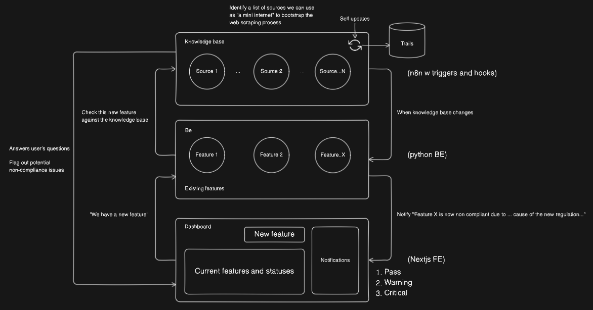

# Hacktok

## Getting Started

Read individual README.md files for each "micro"-service.
You may run them locally or in docker.
Suggest to run each service manually for development.
Use `docker compose up` to run all services.

## Problem

- INSERT CATCHY PROBLEM AND EMPHASISE ON PAIN POINTS

## Our Solution

1. We have a knowledge base on all existing regulations.
2. This knowledge base is "smart" and will auto update itself when new regulations are published.
3. It can be a system that checks for new regulations every single day, or even down to every hour depending on computing resources.
4. When the knowledge base is updated, it will check against existing features and flag out features that need attention (assuming with the new regulation now the feature is not compliant)
5. Similarly, when we are deploying a new feature, we can mock it in the system, and with the knowledge base, it will flag out any potential regulatory conflicts.

6. As for the demo, we can have the knowledge base collect regulatory information from a nation called Hacktok.
7. In Hacktok, we can release a new regulation such as setting social media curfew.
8. We can see that based on this new regulation, can our knowledge base properly detect this new regulation, and flag out (perhaps by notifying) the feature that needs modification.

## Architecture

- **Frontend**: Next.js
- **Backend**: FastAPI
- **Database**: MongoDB
- **N8N**: Workflow automation
- **Docker**: Containerization

### System Integration

- N8N will be our automated knowledge base updater/webscraper
- Backend is for all the business logic
- Frontend for interfacing

We will implement webhooks for N8N to communicate with the BE.
FE will be connected to BE via SSE for real-time updates.

Everything will be dockerised except for MongoDB.
Docker-compose to orchestrate the deployment (volumes and networking etc).
